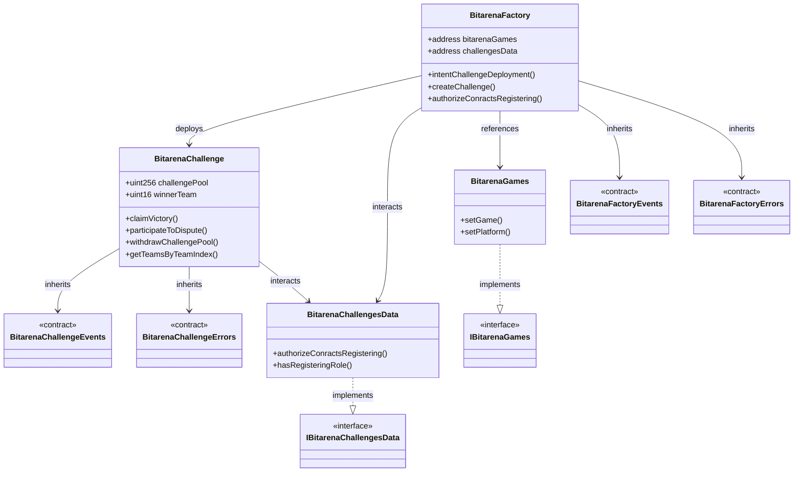

```mermaid
classDiagram
    class BitarenaFactory {
        +address bitarenaGames
        +address challengesData
        +intentChallengeDeployment()
        +createChallenge()
        +authorizeConractsRegistering()
    }

    class BitarenaChallenge {
        +uint256 challengePool
        +uint16 winnerTeam
        +claimVictory()
        +participateToDispute()
        +withdrawChallengePool()
        +getTeamsByTeamIndex()
    }

    class BitarenaChallengesData {
        +authorizeConractsRegistering()
        +hasRegisteringRole()
    }

    class BitarenaGames {
        +setGame()
        +setPlatform()
    }

    class IBitarenaGames {
        <<interface>>
    }

    class IBitarenaChallengesData {
        <<interface>>
    }

    class BitarenaChallengeEvents {
        <<contract>>
    }

    class BitarenaChallengeErrors {
        <<contract>>
    }

    class BitarenaFactoryEvents {
        <<contract>>
    }

    class BitarenaFactoryErrors {
        <<contract>>
    }

    BitarenaFactory --> BitarenaChallenge : deploys
    BitarenaFactory --> BitarenaChallengesData : interacts
    BitarenaFactory --> BitarenaGames : references
    BitarenaChallenge --> BitarenaChallengeEvents : inherits
    BitarenaChallenge --> BitarenaChallengeErrors : inherits
    BitarenaFactory --> BitarenaFactoryEvents : inherits
    BitarenaFactory --> BitarenaFactoryErrors : inherits
    BitarenaGames ..|> IBitarenaGames : implements
    BitarenaChallengesData ..|> IBitarenaChallengesData : implements
    BitarenaChallenge --> BitarenaChallengesData : interacts
```

